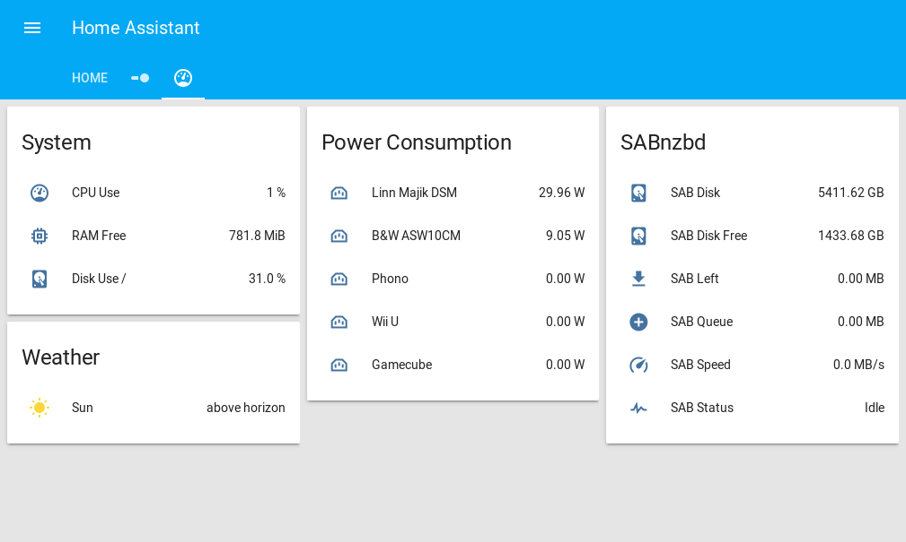

# Home Assistant configuration

My Home Assistant (https://home-assistant.io) configuration files and screenshots.

## Table of contents

* [Controlled devices](#controlled-devices)
* [What's special?](#whats-special)
* [Screenshots](#screenshots)

## Controlled devices

* [Max Hauri maxSMART Power Station](http://www.maxsmart.ch/de/produkte-de/power-station-de.html)
* [Philips Hue lamps](http://www2.meethue.com/de-ch/productdetail/philips-hue-white-and-color-ambiance-starter-kit-a19)
* [Philips 47PFL6007](http://www.mea.philips.com/c-p/47PFL6007H_12/6000-series-smart-led-tv-with-ambilight-spectra-2-and-pixel-precise-hd#see-all-benefits)
* [Linn Majik DSM](https://linn.co.uk/hifi-separates/network-music-players/majik)
* [Kodi media player](https://kodi.tv/) (running on a Raspberry Pi)
* Game consoles and other devices

### Some remarks

* HA's [Philips TV component](https://home-assistant.io/components/media_player.philips_js/) successfully DOSes mine, so I had to deactivate it again. Before the component had existed, I controlled the TV via simple curl requests. I'm now planning on switching to HDMI-CEC.
* Until a certain firmware version, I was able to control my amplifier (the Linn Majik DSM) via simple curl requests as well. After the update to Davaar 50, those curl requests didn't work anymore and I couldn't figure out how to make them work again. The alternatives are UPnP or telnet (LPEC) which both don't yet exist as components in HA and developing something using either of these protocols seems cumbersome. The plan for now is upgrading the amp's HDMI board in order to get HDMI-CEC support.
* Game consoles and other devices aren't controlled directly by HA, which is why I didn't list them above.

## What's special?

### Automation based on power consumption

The Max Hauri maxSMART Power Station can be used to read power consumption and to control socket states. This allows to automatically turn off power for devices that are in standby and which Home Assistant knows are not in use anymore. This is determined by the state of binary switches ('Watch movie', 'Listen to music' etc.).

Another possibility is to automatically switch the source of the amplifier to 'Phono' if the turntable is using energy.

### Presence detection override switch

Automatic presence detection isn't new, but too often I found myself manually setting my own presence via the developer tools because of a restart of Home Assistant. So I added a template-based switch which you might find useful. It reflects the real state but lets you manually override it.

## Screenshots

