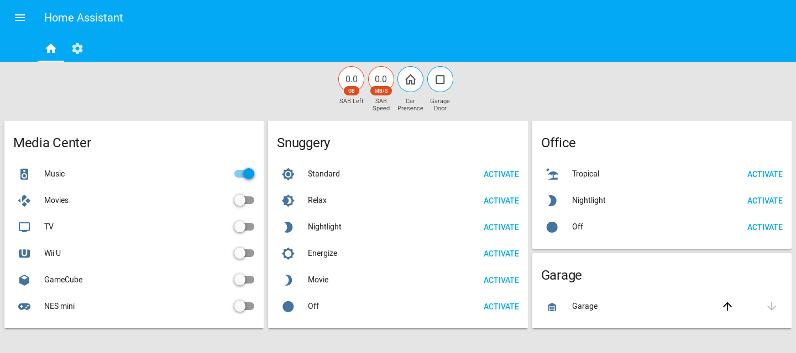
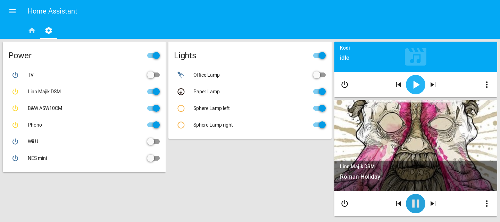

# Home Assistant configuration 

My [Home Assistant](https://home-assistant.io) configuration files and screenshots.

## Table of contents

* [Controlled devices](#controlled-devices)
* [What's special?](#whats-special)
* [Screenshots](#screenshots)

## Controlled devices

* [Ubiquiti mPower power outlets](https://www.ubnt.com/mfi/mpower/)
* [Philips Hue lamps](http://www2.meethue.com/de-ch/productdetail/philips-hue-white-and-color-ambiance-starter-kit-a19)
* [Philips TV](http://www.mea.philips.com/c-p/47PFL6007H_12/6000-series-smart-led-tv-with-ambilight-spectra-2-and-pixel-precise-hd#see-all-benefits)
* [Linn Majik DSM media player](https://linn.co.uk/hifi-separates/network-music-players/majik)
* [Kodi media player](https://kodi.tv/)
* [OpenGarage cover](https://opengarage.io/)
* [iRobot Roomba 960](http://www.irobot.com/)

## What's special?

### Automation based on power consumption

The Ubiquiti mPower outlets can be used to read power consumption and to control socket states. This allows to automatically turn off power for devices that are in standby and which Home Assistant knows are not in use anymore. This is determined by the state of binary switches ('Music', 'TV' etc.).

Another possibility is to automatically switch the source of the amplifier to 'Phono' if the turntable is using energy.

### Switches based on input_select

Sometimes switches on the frontend are more appropriate, prettier or whatever than a dropdown list. The template switches defined in switches.yaml are based on an input_select component and make it possible to do a single selection switches group. So the same logic applies as for a dropdown list with one element active at all times, implemented as switches.

### Visibility of media players

Media players are quite large and take up a lot of space on the frontend. There's two groups containing media_player components, one group's always shown, the other only displays media players when they're active. This configuration is based on [danrspencer](https://github.com/danrspencer)'s work described on the [Home Assistant Forum](https://community.home-assistant.io/t/show-any-currently-active-media-player-on-default-view/23960?u=bliemli) and slightly modified to account for permanent media players.

## Screenshots

